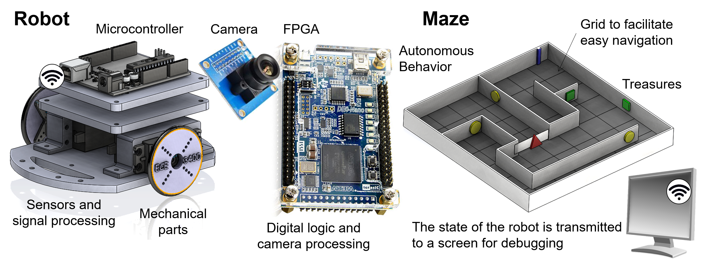

# ECE 3400: Intelligent Physical Systems

## Cornell University, Fall 2017

[<Main Page>](https://cei-lab.github.io/ece3400/)

***

### Course Description

Students will engage in a holistic design approach to Intelligent Physical Systems which can perceive, reason about, and act upon their environment. This course will expand on the ECE 2000-level courses, and include topics on algorithms, field programmable gate arrays, wireless communication, sensors, actuators, power, and mechanics. Students will learn the value and trade-offs between theory, simulation, and physical implementations, and gain familiarity with rapid prototyping techniques, system debugging, team work, leadership skills, time management, and how to disseminate work to a broader audience through webpages.

_Specific outcomes include:_
* The ability to apply specific design methodologies to the course project
* The ability to evaluate what problems are best solved in software, electronics, or mechanics; as well as the trade-offs between theory, simulation, and practical implementations.
* Efficient team work, as a member and as a leader.
* Effectively communication skills through online media.
* Awareness of professional and ethical responsibilities in the context of Intelligent Physical Systems.

Prerequisites include ECE 2100  ECE 2200 and ECE 2300.  Recommended prerequisite: ECE 2400 (or equivalent).
All information is gathered on this page; no additional textbooks are required.

***

### Semester Project

In teams of 5-7 people, you will design, fabricate, and program a robot to explore a maze. The robot microcontroller will be based on an Arduino Uno; the default propulsion method will be differential drive with continuous rotation servos. The robot will traverse the maze by following black lines on a white floor; it must also be able to detect walls, an audible start signal, and treasures emitting infrared light at different frequencies. The robot must continuously transmit its progress wirelessly to a base station (also based on Arduino Uno). This base station will communicate with an FPGA that in turn must drive a screen through a VGA interface. Points will be awarded for speed, accuracy, and innovative design methods. The entire robot can cost no more than $100; this [chart](Cost.md) shows how the price is calculated.

All designs must be documented throughout the semester on a group website. The goal is for these websites to be used as a source of reference for future classes. Accordingly, they will be graded with respect to thoroughness and clarity. However, to give teams a competitive advantage, we ask everyone to keep explicit code and circuit designs private until the end of the semester.

[Rules and final scoring chart](./Grading/Readme.md)

[Here is a great video of the course from 2015.](https://www.youtube.com/watch?v=WN0maCOflVQ)

***
