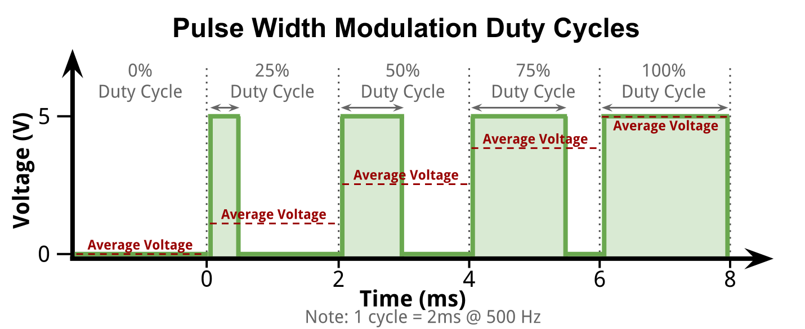

# ECE3400 Fall 2017

## Pulse Width Modulation and Analog Outputs

*By Kirstin Petersen and Yonghun Lee, September 4th, 2017*

Some times actuators/sensors require an analog output from the Arduino. An analog output is a pin that can have any voltage between 0-5V assigned to it, as opposed to a digital pin that can only be either 0 or 5V. 

The Arduino does not actually have any analog output pins, it only has PWM pins. PWM stands for Pulse-Width-Modulation, and is a way in which you rapidly switch on and off the voltage on the pin. By varying the duty cycle (the time the signal remains high compared to the time it is low) you can change the average energy of the signal. A high duty cycle is similar to a higher analog voltage, a low duty cycle is similar to a lower analog voltage.


[(Source)](https://eco-led.ca/news/)
[Arduino has a great description of PWM](https://www.arduino.cc/en/Tutorial/PWM).

If you want, you can add a low-pass filter to the signal to generate a real analog signal. A low pass filter typically requires large capacitors and inductors that take up physical space, therefore these are not actually integrated inside the Arduino. 

Alternatively, you can simply generate a PWM signal with a frequency/period that is much higher than the response time of your system. That way your system acts like a low pass filter itself. An easy example is a motor, it can react very quickly, therefore feeding in a PWM with a frequency of 50kHz will seem like an analog signal. Another example is an LED, since your eyes only perceives frame rates of ~26Hz, varying the duty cycle of a 500Hz signal going into an LED will make it seem like you are dimming it. 

# Arduino: analogOut

As mentioned the Arduino does not have analog output pins, only PWM pins marked by a tilde (~). 
To use these, you can either generate your own PWM signal by setting up timers, or simply use the built in analogWrite function. 

```C
pinMode(PWMpin, OUTPUT); //Set PWMpin to output
analogWrite(PWMpin, 0); //Set pin to (0/255*5V =) 0V
analogWrite(PWMpin, 128); //Set pin to (128/255*5V =) 2.5V
analogWrite(PWMpin, 255); //Set pin to (255/255*5V =) 5V
```

The analogWrite function generates a PWM with 500Hz frequency. You can set the duty cycle between 0 and 255, corresponding to 0-5V. 

